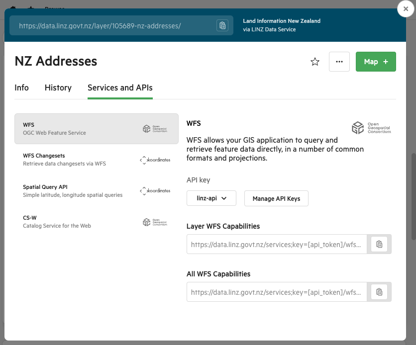

# Koordinates Base

This module facilitates the access to Koordinates public datasets and integration of the datasets into your own data repository such as database and data lake.

## OGC API

The kinds of Open Geospatial Consotium (OGC) API supported by this module are defined in an enumeration.

```typescript
export enum APIKind {
  WFS = "OGC Web Feature Service",
  WMTS = "OGC Web Map Tile Service",
}
```

## KoordinatesDataset

The core functionalities are encapsulated within a single class "KoordinatesDataset".

### Constructor

To access a dataset, you'll need to initialise an object of class KoordinatesDataset by providing some details of the dataset. Take the "NZ Addresses" dataset, which is provided by Land Information New Zealand (LINZ), as an example:

```typescript
import apiKey from "./api-key";

const initialDatasetLocation: string =
  "https://s3.ap-southeast-2.amazonaws.com/linz-datasets.zhiweiliu.com";
const LinzHost: string = "https://data.linz.govt.nz";
const nzAddresses: KoordinatesDataset = new KoordinatesDataset({
  koordinatesHost: LinzHost,
  name: "NZ Addresses",
  layerId: 105689,
  apiKind: APIKind.WFS,
  apiVersion: "v1",
  version: "v2.0.0",
  initialDatasetTs: "2023-12-20T00:00:00Z",
  initialDatasetLocation,
  initialDataset: "nz-addresses.csv",
});

let json = await nza.getLayerCapabilitiesJson(apiKey);
console.log(json);
```

The parameters of the contructor can be found at the "Services and APIs" tab of the dataset page on corresponding Koordinates website. Please refer to the "NZ Addresses" dataset screenshot below.


| Parameter              | Description                                                                                                                                                                |
| ---------------------- | -------------------------------------------------------------------------------------------------------------------------------------------------------------------------- |
| koordinatesHost        | The URL of the Koordinates account of the dataset provider.                                                                                                                |
| name                   | The dataset name given by the dataset provider.                                                                                                                            |
| layerId                | The layer ID of the dataset.                                                                                                                                               |
| apiKind                | The API kind.                                                                                                                                                              |
| apiVersion             | The version of the API.                                                                                                                                                    |
| version                | The version of the dataset.                                                                                                                                                |
| initialDataset         | The dataset is usuallly huge so it is uploaded to a cloud location (AWS S3) to facilitate integrating it into your data repository. This field is the file name on AWS S3. |
| initialDatasetLocation | The cloud location (AWS S3) of the dataset.                                                                                                                                |
| initialDatasetTs       | The timestamp when the dataset was downloaded from Koordinates and uploaded to S3. The "Changesets" API can be then used to bring the dataset up to date.                  |
| hasChangesets          | This is set to true if the dataset implements the "Changesets" API. THe [Changesets](#changesets) method throws exception if this is false.                                |

<span style="color:red">**Note: Please provide your Koordinate API key in a separate file, such as the "api-key.ts" file below. It is suggested to load the key at run time.** </span>

```typescript
let apiKey = "";

if (apiKey === "") {
  apiKey = loadKey();
}

export default apiKey;
```

## Catalog Service for the Web (CS-W)

The following methods return CS-W information in XML or JSON.

```typescript
async getWebCatalogServicesXml(): Promise<string>;
async getWebCatalogServicesJson(): Promise<any>;
```

## Layer Capabilities

The following methods return the layer capabilities in XML or JSON.

```typescript
  /**
   * Get data layer capabilities in JSON
   *
   * @param apiKey - Koordinates API key
   * @returns JSON representation of data layer capabilities which is converted from XML
   */
  async getLayerCapabilitiesJson(apiKey: string): Promise<any>;

    /**
   * Get data layer capabilietes in XML
   *
   * @param apiKey - Koordinates API key
   * @returns XML string
   */
  async getLayerCapabilitiesXml(apiKey: string): Promise<string>;
```

## Site Capabilities

The following methods return the capabilities of a Koordinates site in XML or JSON.

```typescript
  /**
   * Get data layer capabilietes in JSON
   *
   * @param apiKey - Koordinates API key
   * @returns JSON representation of capabilities of a site.
   */
  async getAllCapabilitiesJson(apiKey: string): Promise<any>;

    /**
   * Get data layer capabilietes in XML
   *
   * @param apiKey - Koordinates API key
   * @returns XML string representation of capabilities of a site.
   */
  async getAllCapabilitiesXml(apiKey: string): Promise<string>;
```

## Changesets

The method below returns changesets by specified time range. It works with Web Feature Service (WFS) only.

```typescript
  /**
   * Retrieve Web Feature Service changeset by specified time range
   *
   * @param apiKey
   * @param timestampFrom
   * @param timestampTo
   * @returns A list of changeset objects
   */
  async getWfsChangesets(
    apiKey: string,
    timestampFrom: string,
    timestampTo: string
  ): Promise<any>;
```

## Spatial Query for WFS datasets

The following methods return a list of entities around specified geolocation. These methods work with Web Feature Serivce datasets only.

```typescript
  /**
   * Spatial query API (JSON) for Web Feature Service dataset
   *
   * @param apiKey
   * @param latitude
   * @param longitude
   * @param maxResult
   * @param radius
   * @returns A list of sites in JSON around "latitude" and "longitude" by "radius". The maximum number of records is "maxResult".
   */
  async queryWfsSpatialApiJson(
    apiKey: string,
    latitude: number,
    longitude: number,
    maxResult: number,
    radius: number
  ): Promise<any>;

  /**
   * Spatial query API (XML) for Web Feature Service dataset
   *
   * @param apiKey
   * @param latitude
   * @param longitude
   * @param maxResult
   * @param radius
   * @returns A list of sites in XML string around "latitude" and "longitude" by "radius". The maximum number of records is "maxResult".
   */
  async queryWfsSpatialApiXml(
    apiKey: string,
    latitude: number,
    longitude: number,
    maxResult: number,
    radius: number
  ): Promise<string>;
```

## Spatial query for WMTS datasets

The method below returns a list of entities around specified geolocation. The method works with Web Map Tile Service datasets only.

```typescript
  /**
   * Spatial query API (JSON) for Web Map Tile Service dataset
   *
   * @param apiKey
   * @param latitude
   * @param longitude
   * @returns A list of sites in XML string around "latitude" and "longitude".
   */
  async queryWmtsSpatialApiJson(
    apiKey: string,
    latitude: number,
    longitude: number
  ): Promise<any>;
```

## XYZ tile service query

The method below reuturns a specified XYZ tile in PNG format. It works with Web Map Tile Service datasets only.

```typescript
  /**
   * XYZ Tile service query for Web Map Tile Service dataset.
   *
   * @param apiKey
   * @param x
   * @param y
   * @param zoomLevel
   * @returns image in PNG format which is specified by coordinate (x,y) and zoomLevel.
   */
  async queryXyzTileServiceApi(
    apiKey: string,
    x: number,
    y: number,
    zoomLevel: number = 18
  ): Promise<ArrayBuffer>;
```

## Initial dataset

The following methods will download initial dataset from cloud (AWS S3) to a local folder "./datasets" only if it is not found in the folder. The methods read the downloaded dataset by streaming and in batches to keep the memory usage low.

**Recommendations:**

- The processing of the initial dataset is time-consuming and you'll need to do it once, so please run this on a local PC other than cloud.
- Download the dataset file manually and put it under folder "../datasets", you need to do it just once. No matter how many times you'll run/debug your processing code, the downloaded local file will be used.
- Use the [Changesets](#changesets) method to bring your data repository up to date.
- Schedule a cronjob to run [Changesets](#changesets) method daily to retrieve any further updates.

```typescript
  /**
   * Get the number of records in the initial dataset
   *
   * @returns the number of records in the initial dataset.
   */
  async getInitialDatasetCount(): Promise<number>;

  /**
   * Get a subset of the initial dataset
   *
   * @param start - the start point of batch, starting from 0
   * @param batch  - the size of batch, its maximum value is 100,000
   * @returns a subset of the initial dataset
   */
  async getInitialDatasetInBatch(start: number, batch: number): Promise<any>;
```
